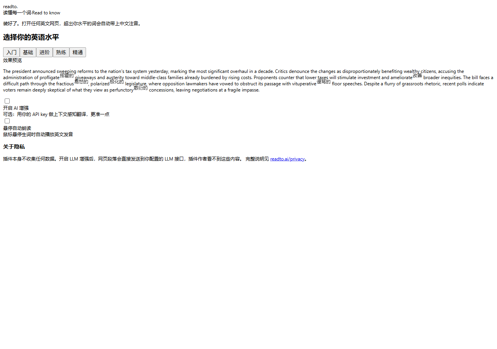
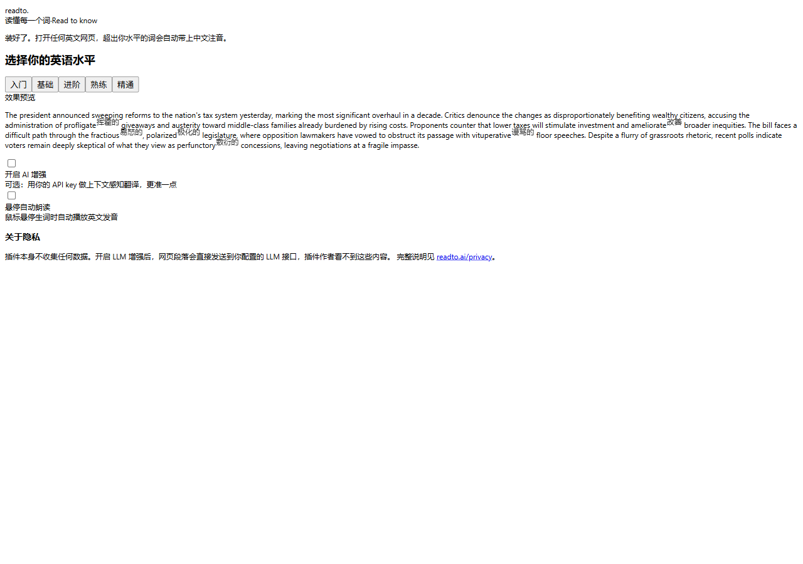

# readto (Reverse-Engineered)

> **Read to know.**

A Chrome extension that adds Chinese annotations above English words you don't know — based on your CEFR level. No popups, no dictionary lookups, no interruptions. Based on the original [readto.ai](https://readto.ai) extension, rebuilt from scratch via reverse engineering.

[Original Extension](https://chromewebstore.google.com/detail/readto/dcnmjckcjcfagfnjblkocojgpnmllcga) · [Original Website](https://readto.ai) · [This Project](https://github.com/gandli/readto-chrome-extension) · [中文文档](README_CN.md)

---

## About

This project is a **reverse-engineered** reimplementation of the [readto](https://readto.ai) Chrome extension. By analyzing the original packed extension (`dist/`), we reconstructed the full source code architecture for:

- **Learning** — understand modern Chrome extension patterns (Manifest V3, Shadow DOM, Service Worker)
- **Customization** — add new features on top of the original (e.g. Bilibili subtitle support)
- **Self-hosting** — build your own version without relying on Chrome Web Store

> ⚠️ This project is for educational purposes only. The original extension's copyright belongs to its author.

## How It Works

1. **Set your English level** — choose from A1 (beginner) to C2 (proficient) using the CEFR framework
2. **Browse any English page** — readto scans the text and identifies words above your level
3. **Read with annotations** — unknown words get small Chinese translations above them, like furigana on Japanese text

No clicking, no sidebar, no context switch. Just read.

## Features

### Core

- **Automatic CEFR-based filtering** — uses a 160,000-word CEFR dictionary to determine which words are "above your level"
- **Inline ruby annotations** — translations appear above words using `<ruby>` elements, similar to Japanese furigana
- **Shadow DOM rendering** — annotations are isolated from the host page, no style conflicts
- **Hover for details** — hover over any annotated word to see phonetics, definitions, and example sentences
- **4-source pronunciation** — Free Dictionary API → Google TTS → Youdao → Browser SpeechSynthesis

### AI-Enhanced (Optional)

- **LLM context-aware translation** — configure your own OpenAI-compatible API for more accurate, context-sensitive translations
- **Streaming preview** — local dictionary translations appear instantly, then LLM translations fill in gaps as they arrive

### Sites

- **YouTube** — annotates video subtitles in real-time
- **Bilibili** — annotates video subtitles (added in this project)
- **GitHub, StackOverflow, Wikipedia** — site-specific rules to avoid annotating code blocks, navigation, etc.
- **Every other English page** — works on any `http://` or `https://` URL

### Design

- **Dark mode** — follows system `prefers-color-scheme` automatically
- **Minimal permissions** — only requires `storage` + `<all_urls>`
- **Privacy-first** — no data collection; LLM mode sends text directly to your configured API

## Screenshots

### Options Page

Set your English level (A1–C2), preview how annotations look, and configure optional features like AI-enhanced translation and auto-pronunciation.

| Light Mode | Dark Mode |
|:---:|:---:|
|  |  |

### Web Page Annotations

Unknown words get small Chinese translations above them, like furigana on Japanese text. No clicking, no popups — just read.


### Translation Tooltip

Hover over any annotated word to see phonetics, definitions, and example sentences. Click the speaker icon to hear pronunciation.


### Full Page View

The extension works on any English page. Annotations blend naturally into the reading flow.


## Differences from Original

| Feature | Original | This Project |
|---------|----------|--------------|
| Source | Chrome Web Store | Reverse-engineered |
| YouTube subtitles | ✅ | ✅ |
| Bilibili subtitles | ❌ | ✅ Added |
| Font loading | Local woff2 (208 files, 11MB) | Google Fonts CDN (0MB) |
| Detail loading | Full JSON (48MB) | Per-letter lazy load |
| Test coverage | None | 462 tests, 81% coverage |
| Build tool | Unknown | Vite + TypeScript |
| Source code | Closed | Open |

## Architecture

```
src/
├── background/
│   └── service-worker.ts        # Message routing, rate limiting, dict loading
├── content/
│   ├── index.ts                 # Main content script (all sites)
│   ├── youtube.ts / youtube-loader.ts   # YouTube subtitle injection
│   ├── bilibili.ts / bilibili-world.ts  # Bilibili subtitle injection (new)
│   └── page-world.ts / page-world-loader.ts  # MAIN world script
├── lib/
│   ├── level-filter.ts          # CEFR word filtering, site rules, annotation rendering
│   ├── level-data.ts            # CEFR dictionary loader (160K words, per-letter lazy load)
│   ├── inline-renderer.ts       # Shadow DOM annotation + LRU cache
│   ├── translations.ts          # Translator factory (local / LLM)
│   ├── llm-stream.ts            # LLM streaming batch translation
│   ├── llm-url.ts               # URL normalization for LLM endpoints
│   ├── pronunciation.ts         # 4-source pronunciation fallback
│   ├── storage.ts               # Chrome Storage abstraction + migration
│   └── stream-preview.ts        # Streaming preview for options page
└── options/
    └── App.tsx                  # Settings UI (React)
```

## Tech Stack

- **TypeScript** + **Vite** (Manifest V3)
- **React** (options page)
- **Vitest** (unit tests, 462 tests, 81% coverage)
- **Playwright** (E2E tests)

## Development

```bash
# Install dependencies
npm install

# Development build (watch mode)
npm run dev

# Production build
npm run build

# Run unit tests
npm test

# Run tests with coverage
npm run test:coverage

# Run E2E tests
npm run test:e2e
```

### Loading the extension locally

1. `npm run build`
2. Open `chrome://extensions`
3. Enable "Developer mode"
4. Click "Load unpacked" → select the `dist/` folder

## Data Files

| File | Size | Purpose |
|------|------|---------|
| `level-data-full.json` | 3.4 MB | CEFR word→level mapping (160K words) |
| `translations-data.json` | 4.4 MB | Local dictionary (phonetics, definitions, examples) |
| `public/assets/detail/` | 48 MB | Per-letter detail files (A-Z, lazy-loaded) |

## Privacy

- **No telemetry** — the extension collects zero data
- **No external servers** — all processing is local
- **LLM mode** — if enabled, paragraph text is sent directly to your configured API endpoint. The extension author never sees this data.

## Credits

- [readto.ai](https://readto.ai) — original extension author, thank you for creating this excellent reading tool
- [CEFR](https://www.coe.int/en/web/common-european-framework-reference-languages) — Common European Framework of Reference for Languages

## License

This project is a reverse-engineered learning project. The original extension's copyright belongs to its author.
For educational use only. Not for commercial purposes.
